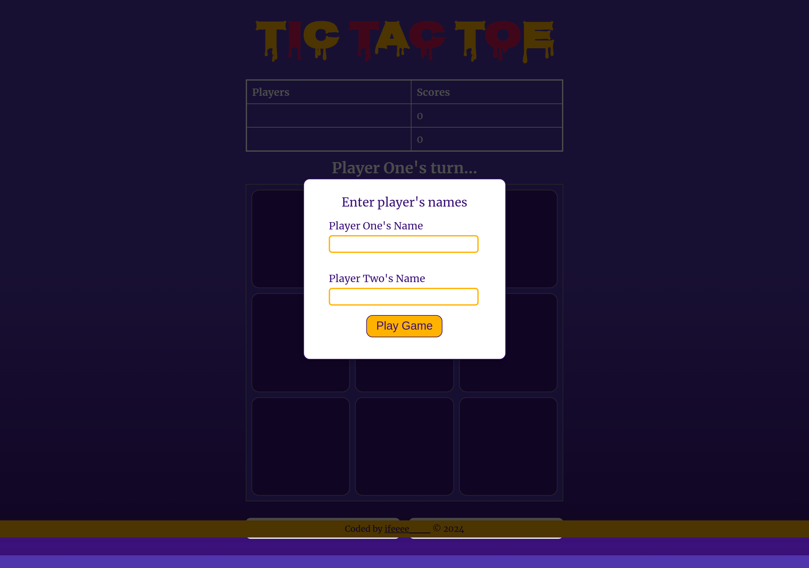

# Tic-Tac-Toe

This is a simple implementation of the classic Tic-Tac-Toe game, project from TOP(The Odin Project) built using JavaScript, HTML, and CSS. Play against a friend and test your strategy!

\*\*Desktop Screenshot

.png>)

\*\*Mobile Screenshot
.png>)
%20(1).png>)

# Features

1. Two-player mode: Compete against a friend in real-time.
2. Responsive design: Play on desktop or mobile devices.
3. Dynamic UI: Buttons reflect the players' moves in real-time.
4. Score tracking: Keep track of player scores across rounds.
5. Reset options: Restart the game or reset scores to start fresh.

# Gameplay

1. Enter player names in the pop-up dialog.
2. Player 1 uses "X", and Player 2 uses "O".
3. Players take turns clicking on cells to place their mark.
4. The game announces the winner when a player aligns three marks horizontally, vertically, or diagonally.
5. If all cells are filled without a winner, the game ends in a draw.
6. Start a new round or reset the entire game at any time.

# Files and Structure

1. index.html: The main HTML structure of the game.
2. style.css: Contains all the styles for the game.
3. script.js: Core game logic and interactions.

# Technologies Used

1. HTML5: For structuring the game interface.
2. CSS3: For styling and responsive design.
3. JavaScript: For implementing game logic and interactions.

# License

This project is licensed under the MIT License.

# Live Preview

[Check the live preview here.](https://nuga25.github.io/Tic-Tac-Toe/)
